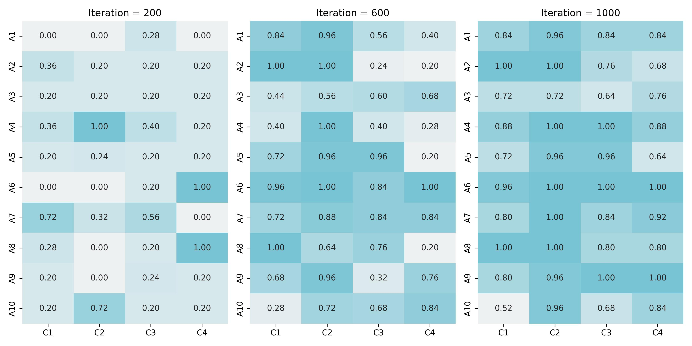

# 📌 Rising Trend: LLM‑Driven Synthetic Data

Large language models (LLMs) have evolved to **synthetic data creators**. Key applications include:
- **Data augmentation:** Enriching datasets in fields where real-world examples are limited.
- **Adversarial probing:** Crafting subtle, hard-to-predict inputs to uncover hidden model weaknesses.
- **Survey design:** Producing multiple phrasings of survey questions to optimize clarity and reduce bias.
- **Scenario simulation:** Generating realistic hypothetical situations for strategic planning and policy evaluation.
<br>

# 📌 Case Study: Synthetic Unsafe Prompts for Safety Assessment
This repository replicates the approach from Samvelyan et al. (2024), “Rainbow Teaming,” which leverages an LLM to produce a large dataset of user prompts specifically designed to **trigger unsafe or undesirable responses** in another LLM.

## Safety Evaluation Workflow

- **Historical Practice:** Security teams and linguistic experts **manually** crafted tricky or malicious prompts to test AI safeguards.
- **LLM‑Accelerated Generation:** The same adversarial prompts are now synthesized at scale:
   - **Volume:** Generate hundreds to thousands of variants in minutes.
   - **Diversity:** Include edge‑case scenarios that human teams might miss.
- **Outcome:** After systematically exposing potential failure modes, practitioners can refine model safety.

The figure below illustrates how the model’s safety metrics improve through successive rounds of synthetic prompt testing:

<br>

## Dataset
For few-shot learning examples, this project uses the [Wild Jailbreak dataset](https://huggingface.co/datasets/allenai/wildjailbreak), a public dataset designed for adversarial robustness testing.
<br>

## Execution
```bash
git clone https://github.com/jean-jsj/llm-in-business/02_synthetic-data-generation.git
cd synthetic-data-generation
pip install -r requirements.txt
python main.py
```

> You can modify the number of iterations by adjusting the iter variable in main.py.
> The script utilizes OpenAI's GPT-4o Mini and GPT-3.5 Turbo.
> Running this code incurs an estimated cost of $3.97 per 1,000 iterations.

